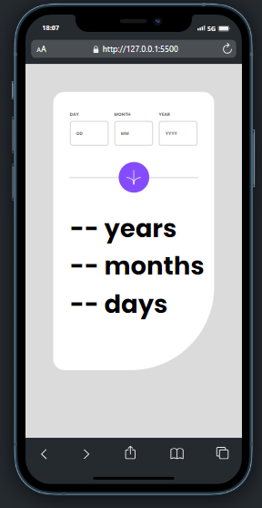
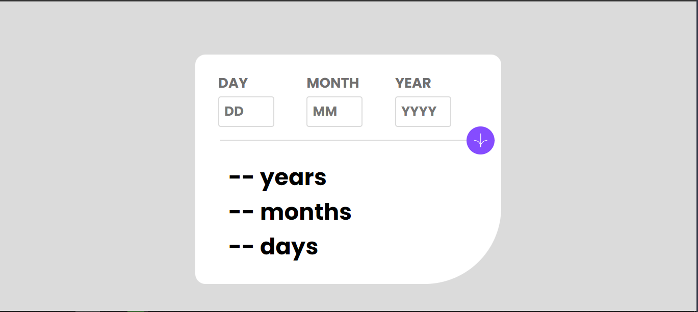
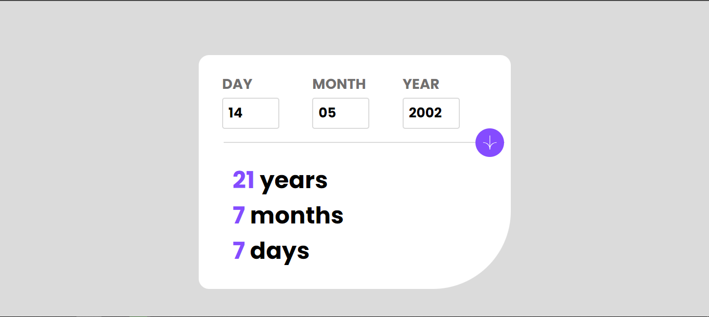

# App Calculate Age 
[](https://github.com/GuilhermeHenrii/Desafio_frontendMentor_appCalculaIdade/blob/main/LICENSE)
# Sobre o projeto

O objetivo desse aplicativo é informar para o usuário qaal o seu tempo de vida em dias meses e anos.
Usei JavaScript vanila e foi um tanto qanto desafiador trabalhar com datas, mas com muita determinação eu consegui. Gostei do resultado final e ficou bem similar ao proposto na plataforma Frontende Mentor.

## Layout mobile
 

## Layout web




## Front end
- HTML / CSS / JS

# Como executar o projeto

Pré-requisitos: npm, VScode, live server

```bash
# clonar repositório
git clone https://github.com/GuilhermeHenrii/Desafio_frontendMentor_appCalculaIdade.git

# entrar na pasta do projeto front end web
cd Desafio_frontendMentor_appCalculaIdade

# executar o projeto
// Rode o live server no arquivo html raiz
```

# Autor

Guilherme Henrique da Silva Lopes

https://www.linkedin.com/in/guilherme-henrique-7aab6b229/

